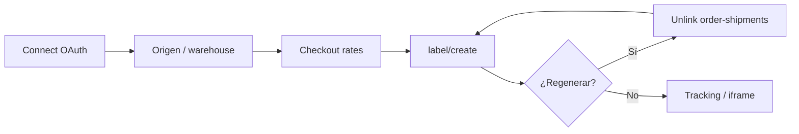
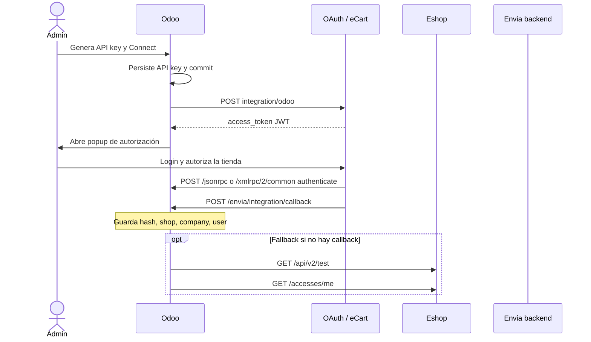
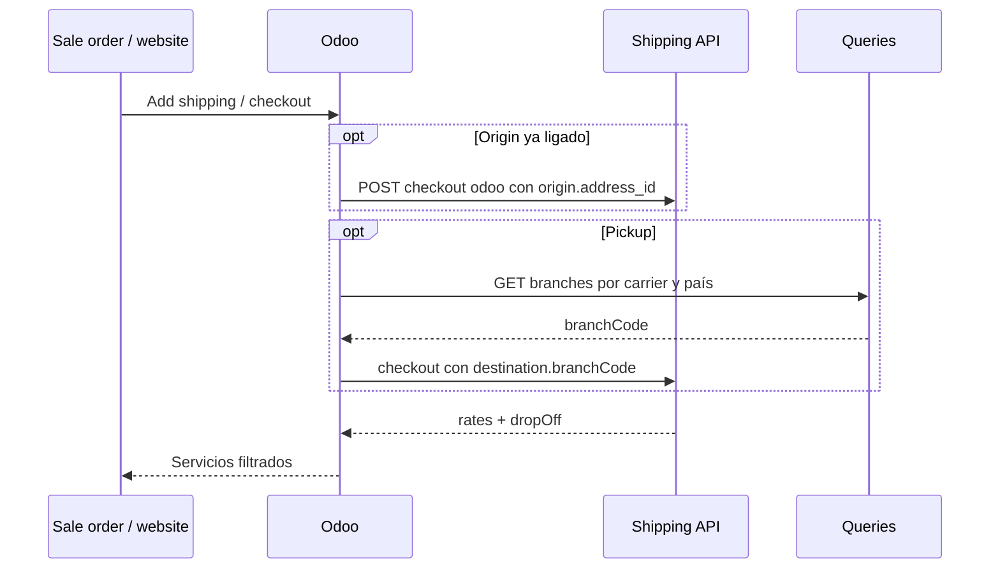
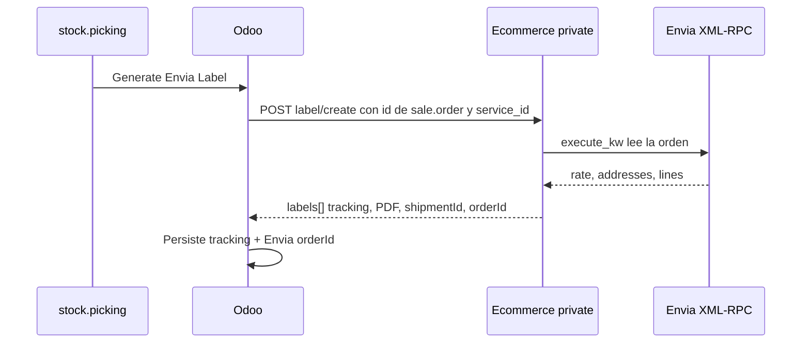
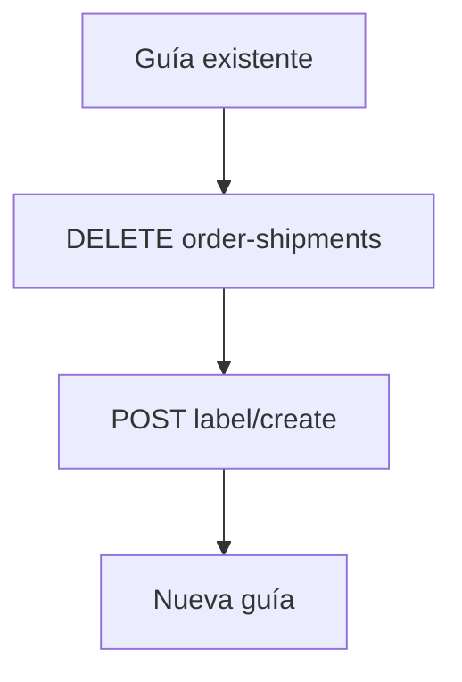

# Envia.com API — guía de integración (plugin Odoo)

Documento para replicar el mismo flujo en otro ecommerce (WooCommerce, Magento o tienda propia) contra las APIs de Envia.com.

El plugin de Odoo es un **conector de tienda**, no un SDK de shipping. Después del OAuth, Envia ya conoce el shop. Cotizaciones, guías y direcciones de origen van con `shop_id`.

Hay dos sentidos de tráfico:

- **Outbound:** Odoo llama a hosts de Envia (OAuth, Shipping API, Queries, Ecommerce private, Geocodes).
- **Inbound:** Envia llama a Odoo (`/envia/integration/callback`, `/jsonrpc`, `/xmlrpc/2/common`, `/xmlrpc/2/object`).

> **Nota:** Las rutas inbound requieren el puente `envia_http` en `server_wide_modules` para funcionar **antes** de seleccionar una base de datos.

## Qué hace el plugin

- Registrar la tienda y recibir **shipping API token** + **shop id**.
- Crear una dirección de origen por defecto y ligarla al shop.
- Pedir tarifas de checkout (domicilio y pickup).
- Crear guías con el id de la orden de venta de Odoo (Envia ya tiene el contexto del carrito vía XML-RPC).
- Desligar o cancelar una guía cuando el merchant la regenera.
- Abrir el dashboard Ecommerce Pro en un iframe (solo hash, nunca el token).

### Ciclo de vida del plugin



> **Nota:** En el HTML para Confluence los flujos van como tablas (sin imágenes externas). En GitHub se ven como diagramas Mermaid.

## Ambientes: sandbox vs production

`ENVIA_ENVIRONMENT` es el único switch. Settings de la compañía **no** lo cambia.

| Servicio | Sandbox / Docker `*envia-dev` | Production / Docker `*envia-prod` | Fallback del módulo (sin `ENVIA_*`) |
| --- | --- | --- | --- |
| Shipping API | `https://api-test.envia.com` | `https://api.envia.com` (Compose) | `https://api-clients.envia.com` |
| Queries | `https://queries.test.envia.com` | `https://queries.envia.com` | igual que Compose prod |
| Ecommerce private | `https://ecommerce-api-new.herokuapp.com` | `https://ecommerce-private.envia.com` | `https://ecommerce-private.envia.com` |
| OAuth register | `https://oauth-deve.herokuapp.com/oauth/{client}/integration/odoo` | `https://oauth.ecartapi.com/oauth/{client}/integration/odoo` | URL eCart de production |
| OAuth popup | `https://oauth-deve.herokuapp.com/{client}?ecommerce=odoo` | `https://oauth.ecartapi.com/{client}?ecommerce=odoo` | URL eCart de production |
| Eshop verify | `https://eshop-deve.herokuapp.com/api/v2/test` | `https://eshop.herokuapp.com/api/v2/test` | deve (overridear con env) |
| Eshop accesses | `https://eshop-deve.herokuapp.com/accesses/me` | `https://eshop.herokuapp.com/accesses/me` | deve (overridear con env) |
| Ecommerce iframe | `https://shipping-test.envia.com/ecommerce` | `https://shipping.envia.com/ecommerce` | iframe de production |
| Geocodes | `https://geocodes.envia.com` | igual | igual |
| Tracking público | `https://envia.com/rastreo?label={tracking}` | igual | igual |

> **Nota:** Shipping y Queries cambian con `ENVIA_ENVIRONMENT`. OAuth/eshop solo cambian con `ENVIA_OAUTH_*` / `ENVIA_ESHOP_*` (Compose las setea).

> **Nota:** El registro OAuth **siempre** manda `sandbox=false`. El switch de ambiente no voltea ese flag.

> **Nota:** Compose production usa `api.envia.com`. Sin env vars el código cae a `api-clients.envia.com`. Al reproducir, usar los valores de Compose.

> **Nota:** El path de checkout es el mismo en ambos ambientes: `v2/checkout/odoo/{shop_id}`. El path de package-dimensions trae `/test/` por default (`package/dimensions/test/{shop_id}`). Override: `ENVIA_PACKAGE_DIMENSIONS_PATH`.

### Variables de entorno

| Variable | Para qué |
| --- | --- |
| `ENVIA_ENVIRONMENT` | `sandbox` o `production` |
| `ENVIA_API_BASE_URL` | Host Shipping API |
| `ENVIA_QUERIES_BASE_URL` | Host Queries |
| `ENVIA_CHECKOUT_PATH` | Template de checkout (`{shop_id}`) |
| `ENVIA_ECOMMERCE_PRIVATE_BASE_URL` | Host de `label/create` y preview de paquetes |
| `ENVIA_PACKAGE_DIMENSIONS_PATH` | Template del preview de paquetes |
| `ENVIA_OAUTH_INTEGRATION_URL` | POST registrar tienda |
| `ENVIA_OAUTH_POPUP_URL` | Popup OAuth en el browser |
| `ENVIA_ESHOP_TEST_URL` | GET verificar integración |
| `ENVIA_ESHOP_ACCESSES_ME_URL` | GET access de la tienda / shipping token |
| `ENVIA_EMBED_BASE_URL` | Override opcional del iframe |

Para pasar Docker de sandbox a production:

- Cambiar el merge anchor en `docker-compose.yml` de `*envia-dev` a `*envia-prod`.
- Reiniciar Odoo.

## Autenticación

Hay **dos secretos distintos**. No mezclarlos.

### API key de Odoo (inbound + registro OAuth)

La genera el wizard Connect (`res.users.apikeys`, scope `rpc`). Se manda a Envia como `apiKey` para que Envia pueda llamar de vuelta a Odoo.

- Body del registro OAuth: campo form `apiKey`.
- Envia → Odoo: header `Authorization: Bearer <odoo_api_key>` y/o JSON `apiKey`.

### OAuth access token (solo eshop)

Lo devuelve `POST …/integration/odoo`. Se usa **solo** para verify/access de eshop.

```http
Authorization: <oauth_jwt>
```

> **Nota:** En este plugin **no** lleva prefijo `Bearer `. Es distinto del token de shipping.

### Shipping API token (Shipping / Queries / Ecommerce private)

Se guarda en `res.company.envia_api_token`. Viene del campo `hash` del callback, o de eshop `/accesses/me`.

```http
Authorization: Bearer <shipping_api_token>
Content-Type: application/json
```

Público (sin auth):

- Queries `generic-form`, `state`, `provinces`.
- Geocodes zipcode.
- Iframe Ecommerce.
- Página de tracking.

## Flujos end-to-end

### Flow A — Conectar la tienda (OAuth)

Este es el handshake que otro plugin debe copiar.

- El admin genera la API key de Odoo y da click en Connect.
- Odoo persiste la API key y hace commit de la DB.
- Odoo llama `POST /oauth/{client}/integration/odoo`.
- OAuth responde con `access_token` (JWT).
- Odoo abre el popup de autorización.
- El admin inicia sesión y autoriza la tienda.
- Envia valida la tienda con JSON-RPC o XML-RPC `authenticate`.
- Envia notifica `POST /envia/integration/callback` (o `/connect`).
- Odoo guarda `envia_api_token`, `envia_shop_id`, `envia_company_id`.
- Fallback si Envia no manda callback: `GET /api/v2/test` y `GET /accesses/me` con el JWT crudo.



Registro OAuth (form-urlencoded):

```http
POST /oauth/{client}/integration/odoo
Content-Type: application/x-www-form-urlencoded

url={store_url}&database={db}&email={email}&apiKey={odoo_api_key}&sandbox=false&callbackUrl={callback}&version={plugin_version}
```

Popup (browser):

```http
GET /{client}?ecommerce=odoo&url={store_url}&database={db}&email={email}&apiKey={odoo_api_key}&company={company_id}&user={user_id}&state=fromPlugin&origin=envia_odoo
```

#### Qué persistir al éxito

| Campo | Origen | Uso después |
| --- | --- | --- |
| `envia_api_token` | callback `hash` (o eshop access) | Bearer de Shipping / Queries / Ecommerce private |
| `envia_shop_id` | callback `shop` | Segmento de path en checkout, labels, addresses |
| `envia_company_id` | callback `company` | Hash del iframe Ecommerce |
| `envia_user_id` | callback `user` | Auditoría / cuenta Envia |
| Store URL | `web.base.url` | Debe ser HTTPS y alcanzable por Envia |

#### Body del callback que Envia pega a Odoo

```json
{
  "status": "success",
  "hash": "<shipping_api_token>",
  "shop": "34084",
  "company": 12345,
  "user": 67890,
  "apiKey": "<odoo_rpc_api_key>",
  "database": "odoo"
}
```

> **Nota:** `hash` es el token de **shipping**, no el JWT de OAuth. Status de éxito aceptados: `active`, `success`, `ok`, `connected`.

#### URLs inbound que Envia debe alcanzar

| Method | Path | Purpose |
| --- | --- | --- |
| POST | `{web.base.url}/envia/integration/callback?db={dbname}` | Guardar token + shop después del OAuth |
| POST | `{web.base.url}/envia/integration/connect?db={dbname}` | Handshake alterno (mismo payload) |
| POST | `{web.base.url}/jsonrpc` | `common.authenticate` con `[db, email, apiKey]` |
| POST | `{web.base.url}/xmlrpc/2/common` | `version` / `authenticate` |
| POST | `{web.base.url}/xmlrpc/2/object` | `execute_kw` (Envia lee/escribe orders y pickings al crear la guía) |

> **Nota:** `web.base.url` tiene que ser HTTPS público (túnel en Docker local). Si Envia no llega a estas rutas, el popup parece exitoso pero la tienda nunca recibe shipping token.

### Flow B — Dirección de origen (warehouse)

Las tarifas salen mejor si el origin es un address id de Envia, no una calle cruda.

- **Schema (público):** `GET {queries}/generic-form?country_code=MX&form=address_info` — arma el form de dirección.
- **Estados / ciudades (público):** `GET {queries}/state?country_code=MX` y `GET {queries}/provinces/{state_code}`.
- **Zip → city/state (público):** `GET https://geocodes.envia.com/zipcode/{country}/{zip}`.
- **Crear address (Bearer):** `POST {queries}/user-address` — incluir `shop_id` y `location_iden` (id interno del warehouse como string).
- **Ligar como default del shop (Bearer):** `POST {queries}/shop-default-address/{shop_id}` con `{"address_id": "..."}`.
- **Listar después:** `GET {queries}/shop-default-address/{shop_id}`.

```mermaid
flowchart TD
    A[Generic-form / state / provinces] --> B[Geocodes zipcode]
    B --> C[POST /user-address]
    C --> D[POST /shop-default-address/{shop_id}]
    D --> E[GET /shop-default-address/{shop_id}]
    E --> F[Checkout origin: address_id]
```

Después de esto, el origin del checkout queda:

```json
{ "address_id": "3834910" }
```

### Flow C — Cotizar tarifas (checkout)

Lo usan: **Add shipping** en la sale order, wizard de quote, checkout web Ship.

```http
POST {api}/v2/checkout/odoo/{shop_id}
Authorization: Bearer {shipping_api_token}
Content-Type: application/json
```

- El origin puede ser `{"address_id": "..."}` si el Flow B ya corrió.
- El destination es un address completo.
- Pickup (ocurre) agrega `destination.branchCode`.
- Odoo no manda dimensiones de paquete (todo `null`); Envia las calcula del catálogo / `productId`.
- Respuesta típica: lista de servicios con precio, días y `dropOff` (`0` = domicilio, `1`/`2` = pickup). El UI filtra por ruta.



**Test connection** (Settings):

```http
GET {queries}/carrier?country_code=MX
Authorization: Bearer {shipping_api_token}
```

> **Nota:** Confirma el shipping token, no el OAuth.

### Flow D — Crear guía (recomendado)

Lo usan: **Generate Envia Label** en el picking / Core `envia_send_shipping`.

```http
POST {ecommerce_private}/label/create/{shop_id}
Authorization: Bearer {shipping_api_token}
Content-Type: application/json

{"id": "<odoo sale.order database id>", "service_id": <envia numeric service id>}
```

> **Nota:** Body: `id` (sale.order) + `service_id` (Envia rate id de la tarifa elegida).

Envia luego lee la orden por XML-RPC (tarifa elegida, addresses, líneas) y responde `data.labels[]` con `trackingNumber`, URL de `label`, `shipmentId`, `orderId`. Persistir:

- `shipmentId` → unlink/cancel después.
- `orderId` → id de orden **ecommerce de Envia** (no el id de Odoo) para el DELETE de `order-shipments`.
- URL del PDF → bajar con GET plano (sin auth).



> **Nota:** Envia debe conservar acceso XML-RPC después del Connect. Si `/xmlrpc/2/object` está bloqueado, crear guía falla o se cuelga.

### Flow E — Reemplazar guía

Desligar el fulfillment de Envia y volver a crear la etiqueta (Flow D):

```http
DELETE {queries}/orders/{shop_id}/{envia_order_id}/fulfillment/order-shipments
Authorization: Bearer {shipping_api_token}
Content-Type: application/json

{"shipment_id": 40772217}
```

> **Nota:** `envia_order_id` es el `orderId` de `label/create`, **no** el id de `sale.order`.



### Flow F — Sucursales pickup (website + wizard)

Cuando el checkout no trae opciones de pickup:

```http
GET {queries}/branches/{carrier}/{country}?type=1&zipcode=64000&allBranch=false
Authorization: Bearer {shipping_api_token}
```

- `type=1` delivery / `type=2` pickup. Odoo usa ambos.
- Después se vuelve a cotizar checkout con `destination.branchCode`.

JSON-RPC de website (solo Odoo, no Envia):

- `POST /shop/envia/delivery/options` — listar Ship o Pickup.
- `POST /shop/envia/delivery/select` — aplicar la tarifa al cart.

Esos dos llaman internamente al Flow C.

### Flow G — Iframe del dashboard

Production:

```http
GET https://shipping.envia.com/ecommerce?hash={base64(store_url:company_id:shop_id)}
```

Sandbox:

```http
GET https://shipping-test.envia.com/ecommerce?hash={base64(store_url:company_id:shop_id)}
```

> **Nota:** Nunca poner el API token en la URL del iframe. Solo hash.

## Catálogo de endpoints

Hosts `{api}`, `{queries}`, `{ecommerce}` = sección Ambientes.

### OAuth / Eshop

| # | Method | URL | Auth | Cuándo | Cómo |
| --- | --- | --- | --- | --- | --- |
| 1 | POST | `{oauth}/oauth/{client}/integration/odoo` | none | Connect, antes del popup | `application/x-www-form-urlencoded`: `url`, `database`, `email`, `apiKey`, `sandbox=false`, `callbackUrl`, `version`. Devuelve JWT OAuth. |
| 2 | GET | `{oauth}/{client}?ecommerce=odoo&url&database&email&apiKey&company&user&state=fromPlugin&origin=envia_odoo` | none (browser) | El usuario autoriza la tienda | Popup / pestaña nueva. El client id es del plugin (Compose vs Apps). |
| 3 | GET | `{eshop}/api/v2/test` | JWT crudo | Verify fallback | Esperar `{"success": true}` |
| 4 | GET | `{eshop}/accesses/me` | JWT crudo | Token/shop fallback | Extraer `shipping_api_token` / shop id / versión del plugin. |

### Shipping API (`{api}`)

| # | Method | Path | Auth | Cuándo | Cómo |
| --- | --- | --- | --- | --- | --- |
| 5 | POST | `/v2/checkout/odoo/{shop_id}` | Bearer shipping | Cotizar | JSON origin, destination, items, package, currency, locale. Origin puede ser `address_id`. Pickup: `destination.branchCode`. |

### Queries API (`{queries}`)

| # | Method | Path | Auth | Cuándo | Cómo |
| --- | --- | --- | --- | --- | --- |
| 7 | GET | `/carrier?country_code=XX` | Bearer | Test connection | Valida el shipping token. |
| 8 | GET | `/branches/{carrier}/{country}` | Bearer | Búsqueda pickup | Query: `type`, `zipcode`, `allBranch`, opcional `locality`, `state`. |
| 9 | GET | `/generic-form?country_code=XX&form=address_info` | none | Schema del form de address | Campos por país para el wizard de origen. |
| 10 | GET | `/state?country_code=XX` | none | Dropdown de estados | Códigos de 2 letras de Envia. |
| 11 | GET | `/provinces/{state_code}` | none | Dropdown de ciudades | Ciudades de un estado. |
| 12 | POST | `/user-address` | Bearer | Crear origin | Ver payload abajo. |
| 13 | GET | `/shop-default-address/{shop_id}` | Bearer | Listar origins | Normalizar `id` / `address` anidado. |
| 14 | POST | `/shop-default-address/{shop_id}` | Bearer | Ligar origin | `{"address_id": "..."}` |
| 15 | DELETE | `/orders/{shop_id}/{envia_order_id}/fulfillment/order-shipments` | Bearer | Reemplazar guía | Body `{"shipment_id": N}` |

#### POST /user-address (mínimo que manda Odoo)

```json
{
  "name": "Warehouse",
  "company": "Warehouse",
  "phone": "8121211454",
  "phone_code": "MX",
  "email": "wh@example.com",
  "country": "MX",
  "district": "Centro",
  "postal_code": "64000",
  "street": "Aurora boreal",
  "number": "201",
  "city": "Monterrey",
  "state": "NL",
  "category_id": 1,
  "type": 1,
  "shop_id": 34084,
  "location_iden": "8"
}
```

> **Nota:** `location_iden` es el id interno de la location de la tienda, como **string**.

### Ecommerce private (`{ecommerce}`)

| # | Method | Path | Auth | Cuándo | Cómo |
| --- | --- | --- | --- | --- | --- |
| 16 | POST | `/package/dimensions/test/{shop_id}` | Bearer | Preview en el UI de quote | `{"items":[{"productId","variantId","name","quantity"}],"currency"}`. Soft-fail si está caído. |
| 17 | POST | `/label/create/{shop_id}` | Bearer | Generar guía | `{"id":"<sale.order id>","service_id":<envia service id>}` |

### Público / browser

| # | Method | URL | Auth | Cuándo | Cómo |
| --- | --- | --- | --- | --- | --- |
| 18 | GET | `https://geocodes.envia.com/zipcode/{country}/{zip}` | none | Llenar city/state | Mismo host en sandbox y prod. 404 → vacío. |
| 19 | GET | `{embed}?hash=…` | none | Dashboard | `hash = base64(store_url:company:shop)` |
| 20 | GET | `https://envia.com/rastreo?label={tracking}` | none | Track | Core `envia_get_tracking_link` |
| 21 | GET | `{labelUrl from create}` | none | Bajar PDF | URL CDN/S3 de la respuesta de create. |

### Inbound en la tienda (hay que exponerlos)

| # | Method | Path | Auth | Quién llama | Cómo |
| --- | --- | --- | --- | --- | --- |
| 22 | POST | `/envia/integration/callback` | Bearer API key Odoo | Envia después del OAuth | JSON del Flow A. Persistir token + shop. |
| 23 | POST | `/envia/integration/connect` | Bearer API key Odoo | Handshake Envia | Mismo payload que el callback. |
| 24 | POST | `/jsonrpc` | args en el body | Validación de tienda | `method=call`, `service=common`, `method=authenticate`, `args=[db, email, apiKey]` |
| 25 | POST | `/xmlrpc/2/common` | XML-RPC | Envia | `version`, `authenticate` |
| 26 | POST | `/xmlrpc/2/object` | XML-RPC | Envia al crear guías | Proxy `execute_kw` hacia la tienda. |

## Payload de checkout (quote)

```json
{
  "origin": { "address_id": "3834910" },
  "destination": {
    "name": "Customer",
    "company": "Customer",
    "email": "customer@example.com",
    "phone": "8181111111",
    "street": "Calle Aurora",
    "number": "201",
    "district": "Centro",
    "city": "Monterrey",
    "state": "NL",
    "country": "MX",
    "postalCode": "64000"
  },
  "items": [
    {
      "quantity": "1",
      "width": null,
      "height": null,
      "length": null,
      "weight": "1.00",
      "price": "100.00",
      "requiresShipping": "true",
      "productId": "82",
      "variantId": null
    }
  ],
  "package": {
    "content": "Merchandise",
    "amount": "1",
    "type": "box",
    "dimensions": { "length": null, "width": null, "height": null },
    "weight": "1.0",
    "lengthUnit": null,
    "weightUnit": "KG",
    "insurance": "0",
    "declaredValue": "100.00"
  },
  "currency": "MXN",
  "locale": "es"
}
```

> **Nota:** Mapeo de estados MX en este plugin: Odoo `CMX` / `DIF` / `DF` → Envia `CX`; `NLE` / `NUE` → `NL`.

## Orden recomendado (plugin nuevo)

- URL HTTPS pública de la tienda y API key RPC que la plataforma pueda validar.
- OAuth register + popup + callback (Flow A). Persistir `hash` y `shop`.
- Test `GET /carrier` con el shipping token.
- Dirección de origen (Flow B) y guardar `address_id`.
- Tarifas de checkout (Flow C) con `origin.address_id`.
- Exponer XML-RPC / JSON-RPC para que Envia lea órdenes.
- `label/create` con el id de tu orden (Flow D).
- Persistir `shipmentId` + `orderId` de Envia; implementar unlink antes de recrear.
- Opcional: branches, preview de package-dimensions, iframe Ecommerce.

> **Nota:** Un plugin ecommerce usa checkout con `shop_id` y `label/create`. No uses otros endpoints de guía.

## Errores que este plugin ya mapea

| HTTP / code | Significado |
| --- | --- |
| 401 / 403 en Bearer shipping | `envia_api_token` inválido (reconnect) |
| 402 | Saldo insuficiente en Envia |
| `INVALID_POSTAL_CODE` | Zip de origin/destination inválido |
| `NO_RATES_AVAILABLE` | No hay servicios para la ruta |
| `WEIGHT_EXCEEDS_LIMIT` | Paquete demasiado pesado |
| Checkout `meta=error` code 1365 | Habilitar Checkout y seleccionar paqueterías en Envia.com |
| `label/create` HTTP 400 | Payload inválido (falta `id` / `service_id`) |
| DELETE 403 con mensaje de negocio | Orden/shipment no encontrado — no es token inválido |

## Mapa de código (referencia Odoo)

| Concern | File |
| --- | --- |
| Hosts / env switch | `envia/services/envia_config.py` |
| OAuth client | `envia/services/envia_oauth_client.py` |
| HTTP client | `envia/services/envia_client.py` |
| Checkout / labels / cancel | `envia/services/envia_official_adapter.py` |
| Connect wizard | `envia/wizards/envia_plugin_connect_wizard.py` |
| Callback apply | `envia/services/envia_integration_callback.py` |
| Nodb HTTP bridge | `envia_http/controllers/integration.py` |
| Website pickup | `envia/services/website_pickup.py` |
| Iframe hash | `envia/const.py` |
